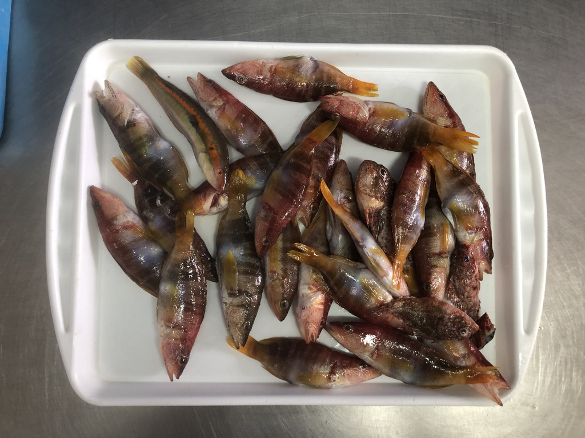

# Dynamic-image-exposure-rate
Dynamic adjustment of image exposure rate with tracking bar using the the gamma function

## Explain

As can be seen in the graph of the gamma function, when R>1, the curve is below R=1 and the value of the color space decreases, making the image less bright, becoming an image of little exposure. When 0<R<1, the curve is above R=1 and the value of the color space increases. Macroscopic performance is the increase in image brightness, becoming an image of a lot of exposure.

## Results 
<table>
  <tr>
    <td>R=1</td>
    <td>R=1.5</td>
  </tr>
  <tr>
    <td></td>
    <td></td>
  </tr>
 </table>
 
 ## How to use
 - 1: Put the images to transform in the folder /img_in/
 - 2: In the top you can see a track bar, the value of the track bar is R/0,01
 
  
 
 | R | Track bar     | 
| :-------- | :------- | 
| 1 | 100 |
| 0,5 | 50 |
| 1,5 | 150 |

- 3: Press enter to move to the next image
- 4: The transformed images are saved in the folder /img_out/

