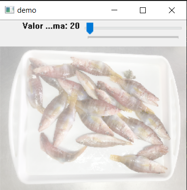

# dynamic-image-exposure-rate
Dynamic adjustment of image exposure rate with tracking bar

<table>
  <tr>
    <td>Debevec's method</td>
    <td>Drago's method</td>
    <td>R=1</td>
    <td>Drago's method</td>
    <td>Drago's method</td>
  </tr>
  <tr>
    <td></td>
    <td></td>
    <td></td>
    <td></td>
    <td></td>
  </tr>
 </table>
